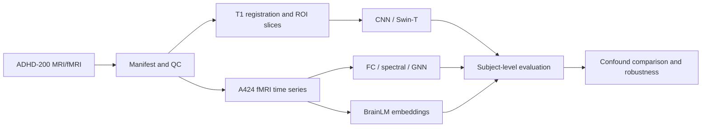

# ADHD-200 MRI/fMRI Classification

[](https://github.com/NingyuSUN/adhd-mri-fmri/actions/workflows/ci.yml)
[](LICENSE)

This portfolio project demonstrates an end-to-end deep-learning workflow for structural MRI and resting-state fMRI: data engineering, neuroimaging preprocessing, CNN/GNN/Transformer modeling, leakage-safe evaluation, robustness analysis, and reproducible scripted execution.

**Project status: completed deep-learning case study.** The technical objective is to demonstrate the ability to build and evaluate real medical-AI pipelines—not to claim a clinically deployable ADHD diagnostic system.

## Portfolio highlights

| Area | Demonstrated work |
|---|---|
| Data engineering | Multi-site BIDS discovery, phenotypic-label recovery, subject deduplication, QC, caching, checkpointed Google Drive pipelines |
| Structural MRI | Slice and ROI pipelines, MNI registration, CNNs, pretrained Swin-T, ComBat and ablation studies |
| Functional MRI | A424 time-series extraction, functional connectivity, spectral features, motion scrubbing, network modules |
| Deep learning | 2D/3D CNN concepts, GNN prototypes, frozen BrainLM transfer learning, Transformer comparison |
| Evaluation | Subject-level splits, site-stratified CV, nested LOSO stress testing, bootstrap uncertainty, confound baselines |
| Research practice | Leakage prevention, reproducibility, model card, limitations, clinically responsible interpretation |



For a concise portfolio narrative and interview-ready discussion, see [PORTFOLIO_CASE_STUDY.md](PORTFOLIO_CASE_STUDY.md).

## Five-minute engineering demo

This repository includes a recruiter-safe aggregate-only path that does not need private MRI data:

```bash
python tools/portfolio_quickstart.py --output-dir artifacts/portfolio_quickstart
cat artifacts/portfolio_quickstart/summary.md
python tools/validate_public_artifacts.py
```

The quickstart, `Makefile`, locked statistics environment, and [CI workflow](.github/workflows/ci.yml) show the engineering path. The [engineering guide](docs/ENGINEERING.md) explains data contracts, failure modes, and the boundary between this demo and the private full replay.

## Scientific outcome

The analyses do not support a reliable cross-site ADHD predictor from the available MRI/fMRI representations.

- In the portfolio-oriented repeated 4-fold site-and-label-stratified CV (`5` repeats, `20` outer evaluations, `n=409`), age + sex + motion/QC reached mean AUC **0.677 ± 0.058**.
- The strongest image-only/representation result in that experiment was FC + frozen BrainLM at **0.595 ± 0.031**; FC ROI summary reached **0.583 ± 0.036**, spectral features **0.570 ± 0.035**, and frozen BrainLM alone **0.529 ± 0.043**.
- A follow-up end-to-end experiment trained a 1D-CNN and temporal Transformer directly on standardized A424 parcel time series. Their four-fold mean AUCs were **0.580 ± 0.057** and **0.578 ± 0.056**, below the locked image-only RBF-SVM baseline of **0.622**.
- Structural MRI also failed the strict generalization test: Swin-T reached LOSO OOF AUC **0.579** versus **0.619** for age + sex, while the ROI-guided CNN reached **0.470**.
- In the locked fMRI cohort (`n=409`), age + sex + motion/QC reached macro LOSO AUC **0.686**.
- The best tested image-only fMRI result was frozen BrainLM at **0.512** macro LOSO AUC; spectral, FC-summary, and full-edge models were approximately chance or worse.
- Adding BrainLM to confounds reduced performance from **0.686** to **0.622**.
- Training-fold residualization, within-site validation, strict motion restriction, frame scrubbing, and spatial network aggregation did not reveal a stable image-derived gain.
- A QC-locked round retraining structural, functional and non-imaging models together on one frozen protocol and three prespecified cohorts (350 / 302 / 375) gave the same picture: non-imaging control **≈ 0.71**, adding functional imaging **−0.013 (1/5 repeats positive)**, adding structural on top **−0.010 (0/5)**. See [`docs/structural_functional_fusion.md`](docs/structural_functional_fusion.md).

The defensible interpretation is that the dataset contains strong demographic/site/motion structure, while the tested neuroimaging features do not generalize reliably to unseen sites.

## Headline fMRI results

| Evaluation | Model | N | AUC |
|---|---|---:|---:|
| Repeated site+label-stratified CV | age + sex + motion/QC | 409 | 0.677 ± 0.058 |
| Repeated site+label-stratified CV | FC + BrainLM | 409 | 0.595 ± 0.031 |
| Repeated site+label-stratified CV | FC ROI summary | 409 | 0.583 ± 0.036 |
| Repeated site+label-stratified CV | BrainLM frozen | 409 | 0.529 ± 0.043 |
| Strict nested LOSO | age + sex + motion/QC | 409 | 0.686 |
| Strict nested LOSO | motion/QC | 409 | 0.664 |
| Strict nested LOSO | age + sex | 409 | 0.583 |
| Strict nested LOSO | BrainLM frozen | 409 | 0.512 |
| Strict nested LOSO | FC + BrainLM | 409 | 0.501 |
| Strict nested LOSO | spectral | 409 | 0.492 |
| Strict nested LOSO | FC ROI summary | 409 | 0.477 |
| Strict nested LOSO | full FC edges, top 2000 | 409 | 0.430 |
| Strict nested LOSO | confounds + BrainLM | 409 | 0.622 |

See [RESULTS.md](RESULTS.md) and [FINAL_REPORT.md](FINAL_REPORT.md) for the full interpretation and robustness analyses.

## Evaluation strategy

For portfolio presentation, the primary within-dataset experiment uses repeated site-and-label-stratified subject-level cross-validation. The completed LOSO analysis is retained as an advanced domain-shift stress test rather than the only definition of project success.

- Splits are performed by subject, never by slice or time window.
- The portfolio benchmark uses repeated four-fold CV stratified jointly by site and label; imputation, scaling, and regularization selection are fit inside each training fold.
- The reported portfolio number is the mean AUC across 20 outer folds, with standard deviation across folds.
- LOSO is reported separately as an unseen-site stress test; held-out sites are not used for scaling, feature selection, residualization, or hyperparameter selection.
- The planned v2 reanalysis did not confirm its primary equivalence hypothesis: CV was inconclusive and the primary LOSO estimate was positive but changed sign across QC cohorts. A [post hoc audit](docs/paper/STATISTICAL_INTERPRETATION.md) corrects NYU's primary case-control pair weight to 67.07% (39.7% is its participant fraction) and shows that the QC shift persists on common test subjects. Final fusion-weight selection contributes strongly to that shift. The [reproduction package](reproduction/README.md) and [aggregate sensitivity results](results/paper_readiness_20260911/) document the analysis and its limits.
- The independent feature-level replay is now accepted for all 66 units (45 CV and 21 LOSO): all 17 model outputs per unit, final fusion weights, aggregate summaries, five statistical tables, the original decision, and three figures matched the frozen reference. See [fresh reproduction status](docs/paper/FRESH_REPRODUCTION_STATUS.md) and the collected [fresh-refit evidence](results/paper_readiness_20260911/fresh_refit/).
- Every image model is compared with non-image confound baselines.
- A model is not considered useful merely because its AUC is above 0.5; it must add stable out-of-site information beyond confounds.

## Maintained project entrypoints

The final package keeps executable, tested code and reviewed aggregate evidence. Exploratory notebooks and their unused support code are available through Git history rather than the current branch.

1. Aggregate-only reviewer path: `make quickstart` and `make validate-public`.
2. Fresh feature-level replay and saved-prediction analyses: [`reproduction/README.md`](reproduction/README.md).
3. Table and figure assembly: [`reporting/`](reporting/).
4. Structural + functional late-fusion method and results: [`docs/structural_functional_fusion.md`](docs/structural_functional_fusion.md).
5. Confirmatory v2 analysis and post hoc audit: [`docs/analysis_v2_results.md`](docs/analysis_v2_results.md) and [`docs/paper/`](docs/paper/).
6. Publication-ready aggregate package: [`results/tables_figures_20260914/`](results/tables_figures_20260914/).

Aggregate tables, figures, manifests, and non-subject-level replay summaries are versioned in `results/`. Subject-level predictions, model checkpoints, raw MRI, and large intermediate arrays remain private and are not committed.

## Repository structure

```text
adhd-mri-fmri/
├── README.md
├── FINAL_REPORT.md
├── MODEL_CARD.md
├── PROJECT_STATUS.md
├── METHODS.md
├── RESULTS.md
├── LIMITATIONS.md
├── REPRODUCIBILITY.md
├── DATA.md
├── reproduction/           # maintained fitting, statistics, verification, and tests
├── reporting/              # reproducible table and figure assembly scripts
├── tools/                  # aggregate-only quickstart and public-artifact validator
├── demo/                   # five-minute recruiter-safe demo contract
├── .github/workflows/      # automated repository checks
├── Makefile                # local engineering entrypoints
├── results/                # aggregate tables, figures, and replay summaries
├── docs/paper/              # statistical interpretation, evidence, and validation notes
├── docs/
└── figures/
```

## Data

The project uses the ADHD-200 multi-site dataset:

- T1-weighted structural MRI
- resting-state fMRI derivatives
- phenotypic labels and demographic variables
- motion and QC measurements where available

Raw data are not included. Choose your own data directory; the historical fMRI
outputs belong under `fmri/strict_loso_benchmark/` relative to that directory.
No particular drive mount or personal working directory is required.

See [DATA.md](DATA.md) for the expected layout.

## Reuse

The code and result tables can be used as a benchmark for confound-aware neuroimaging classification. They must not be presented as a clinical ADHD diagnostic system.

## Author and license

Ningyu Sun. Code is released under the MIT License; ADHD-200 data remain subject to their original terms.
