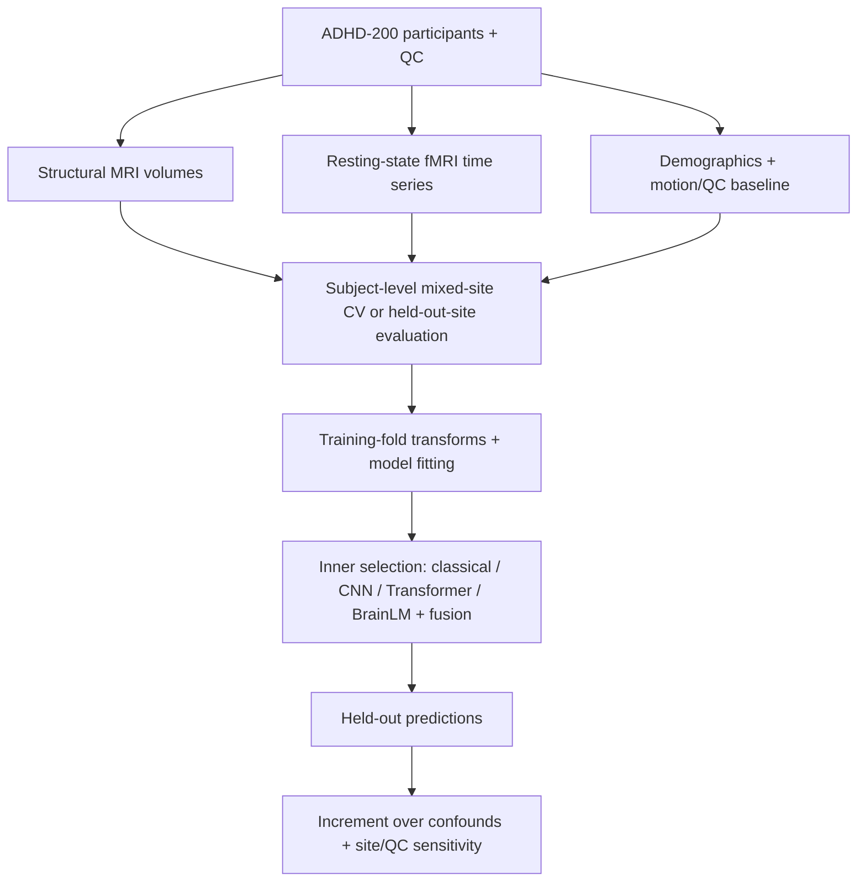

# ADHD-200: multimodal classification and cross-site generalization

[](https://github.com/NingyuSUN/adhd-mri-fmri/actions/workflows/ci.yml)
[](LICENSE)

**Do structural MRI and resting-state fMRI add predictive information beyond
demographics and motion, and does that information transfer to unseen sites?**

This completed research case study combines neuroimaging data preparation,
classical and deep-learning representations, subject-level evaluation, and
confound analysis. The tested imaging models did not establish stable
confound-independent generalization across sites. The work documents how to
identify that failure and make the analysis reproducible.

## Evaluation workflow



This summarizes several experiments; each uses its documented cohort and split.
Calibration diagnostics are descriptive; independent external validation is absent.

## Main findings

Selected fMRI results on the 409-subject benchmark:

| Evaluation | Features | ROC-AUC |
|---|---|---:|
| Repeated mixed-site CV | Age + sex + motion/QC | 0.677 ± 0.058 |
| Repeated mixed-site CV | Functional connectivity + frozen BrainLM | 0.595 ± 0.031 |
| Nested leave-one-site-out | Age + sex + motion/QC | 0.686 |
| Nested leave-one-site-out | Frozen BrainLM | 0.512 |

Mixed-site CV uses five repeats of four subject-level folds stratified by site
and label; ± values are fold standard deviations, not confidence intervals.
LOSO values are macro averages across evaluable held-out sites. These protocols
answer different questions and should not be treated as interchangeable scores.

Structural models also failed to show a reliable advantage over confounds.
Later fusion analyses were sensitive to QC cohort and model-selection choices;
the confirmatory equivalence hypothesis was not established.
See [results](RESULTS.md) and the [statistical interpretation](docs/paper/STATISTICAL_INTERPRETATION.md).

## Five-minute review

From the repository root, using Python 3.10 or later:

```bash
python tools/portfolio_quickstart.py --output-dir artifacts/portfolio_quickstart
python tools/validate_public_artifacts.py
```

Open `artifacts/portfolio_quickstart/summary.md` for the generated report and
the [table and figure index](results/tables_figures_20260914/index.html) for the
full aggregate package.

This demo reads and checks committed aggregate results. It does **not** train a
model or reproduce raw-image preprocessing, and it requires no subject-level data.

## Methods and engineering

- Structural MRI and fMRI preparation, QC, feature extraction, and cached compute.
- CNN and Transformer experiments, connectivity baselines, and frozen BrainLM representations.
- Subject-level splits: slices and time windows from one participant stay together.
- Training-fold preprocessing and model selection, with demographic and motion/QC baselines.
- Motion, QC, residualization, and fusion sensitivity analyses.
- Versioned aggregate outputs, integrity checks, and automated repository validation.

The recorded [feature-level replay acceptance](docs/paper/FRESH_REPRODUCTION_STATUS.md)
covers 66 evaluation units (45 CV and 21 LOSO).
The [reproduction guide](reproduction/README.md) describes the required private
derivatives and execution environment. This evidence does not establish
end-to-end reproducibility from raw MRI.

## Scope and project guide

Research use only: this is not an ADHD diagnostic system. Site and demographic
structure, overlapping QC cohorts, limited sample size, and selection instability
restrict interpretation. Negative findings apply to the tested data and methods,
not every possible imaging biomarker.

[Case study](PORTFOLIO_CASE_STUDY.md) · [Methods](METHODS.md) ·
[Engineering guide](docs/ENGINEERING.md) · [Data](DATA.md) ·
[Limitations](LIMITATIONS.md) · [Model card](MODEL_CARD.md) ·
[Project status](PROJECT_STATUS.md)

Code: MIT. ADHD-200 data remain subject to their original terms.
